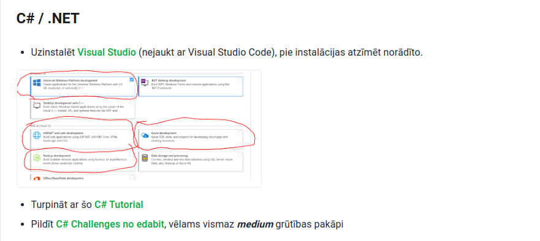

# C# / .NET

- Install [Visual Studio](https://visualstudio.microsoft.com/vs/community/) (not to be confused with Visual Studio Code)
- Take this [C# Tutorial](https://www.tutorialspoint.com/csharp/index.htm)
- Complete challenges from [@edabit](https://edabit.com/challenges), preferably at least _medium_
- Complete tasks from the [solutions folder](./solutions/)
